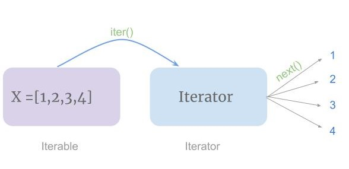

## linked-list

**A Python Implementation of a Linked List**

## 2025 Note

To potential employers: I created this back in 2020. My Python skills have improved a great deal since then.

## Overview

_Original Text:_

Python has lists, obviously, but they're really arrays under the hood. I decided to try my hand at creating a proper linked list class, one with the traditional advantages of linked lists, such as fast insertion or removal operations. I'm sure I was reinventing the wheel, but this was still a worthwhile exercise for me.

I also created a test framework, which takes advantage of Python decorators. The test module creates a series of linked lists and performs various operations on them. At each step, the decorator function makes sure the list is valid.

One test involves performing random operations on a linked list, while mirroring the same operations with a regular Python list. At the end of the sequence, the linked list and the regular list are compared.

Feel free to use this code.

## Design

 

This is a doubly-linked list, as shown above. It does many of the common things we would want a linked list class to be able to do.

One innovation I added is the concept of a node cache. That is, the linked list maintains a cache of select nodes that it remembers the indices of. Periodically, the cache is rebuilt, with the cached nodes distributed more or less evenly across the whole list. Thus, if the caller wants the item at a particular index, it's not necessary to iterate through the entire linked list. Rather, the cache is searched for a node close to the desired one and iteration happens from there.

## Operations

 

#### Finding

* get item (by index)
* find item (by value)

#### Adding

* add head (add to front of list)
* add tail
* insert (at arbitrary index)

#### Removing

* pop head
* pop tail
* remove (from arbitrary index)

#### Whole List

* clear
* copy
* reverse
* sort
* join (combine two lists into one)
* split (split a list into two lists)

#### Iterator



The linked list can be iterated through in the standard Python way:
 
```
for item in linked_list:
    # do something
```

Or

```
for n,item in enumerate(linked_list):
    # do something
```

## Installation

Download the whole package, then install from the top-level folder as follows:

`D:\CodingProjects\Python\LinkedList>python scripts\linked_list>pip install .`

## Running Tests


`Unit-testing before going live is usually wise`

Run with:

(Windows)   
`D:\CodingProjects\Python\LinkedList>python scripts\linked_list>python scripts\linked_list --verbosity CODE --seed RANDOMSEED --test TESTNUM --help`

(Linux-y)  
`$ linked_list --verbosity CODE --seed RANDOMSEED --test TESTNUM --help`

Argument | Description
---------|------------
`help` | Print help
`verbosity` | Level of verbosity: 0 to 2. 2 is most verbose.
`seed` | A seed for random number generation. Use same seed for repeatable results.
`test` | Which test to run (don't specify to run all)

## Sample Output

A few tests, less verbose output:

```
Running test 7: SORTING
pre-sorted: ['h', 'b', 'j', 'e', 'a', 'c', 'f', 'd', 'g', 'i']
sorted to: ['a', 'b', 'c', 'd', 'e', 'f', 'g', 'h', 'i', 'j']
sorted rand list: [563, 568, 935, 1561, 2506, 3280, 6101, 6175, 9693, 9765]
sorted rand list, reverse: [9765, 9693, 6175, 6101, 3280, 2506, 1561, 935, 568, 563]

Running test 8: JOINING
join list 1: ['elephant', 'giraffe', 'hippo']
join list 2: ['gazelle', 'rhinoceros']
new join list 1: ['elephant', 'giraffe', 'hippo', 'gazelle', 'rhinoceros']
new join list 2: []

Running test 9: SPLITTING
split list: ['elephant', 'giraffe', 'hippo', 'gazelle', 'rhinoceros']
split-off list: ['hippo', 'gazelle', 'rhinoceros']
remaining list: ['elephant', 'giraffe']
```

A few random operations, involving random data. More verbose output.

```
Running test 5: RANDOM TEST
seed=89951
last_operation_str: add_head, item=3487
list is: [3487]
    length is: 1
    cache is: (0, 3487), (-1, --), (-1, --), (-1, --), (-1, --), (-1, --), (-1, --), (-1, --), (-1, --), (-1, --)
--------------------
last_operation_str: add_head, item=3487
list is: [3487]
    length is: 1
    cache is: (0, 3487), (-1, --), (-1, --), (-1, --), (-1, --), (-1, --), (-1, --), (-1, --), (-1, --), (-1, --)
--------------------
last_operation_str: add_tail, item=283
list is: [3487, 283]
    length is: 2
    cache is: (0, 3487), (1, 283), (-1, --), (-1, --), (-1, --), (-1, --), (-1, --), (-1, --), (-1, --), (-1, --)
--------------------
last_operation_str: pop_head
list is: [283]
    length is: 1
    cache is: (0, 283), (-1, --), (-1, --), (-1, --), (-1, --), (-1, --), (-1, --), (-1, --), (-1, --), (-1, --)
--------------------
last_operation_str: add_head, item=937
list is: [937, 283]
    length is: 2
    cache is: (0, 937), (1, 283), (-1, --), (-1, --), (-1, --), (-1, --), (-1, --), (-1, --), (-1, --), (-1, --)
--------------------
last_operation_str: pop_head
list is: [283]
    length is: 1
    cache is: (0, 283), (-1, --), (-1, --), (-1, --), (-1, --), (-1, --), (-1, --), (-1, --), (-1, --), (-1, --)
--------------------
last_operation_str: pop_head
list is: []
    length is: 0
    cache is: (-1, --), (-1, --), (-1, --), (-1, --), (-1, --), (-1, --), (-1, --), (-1, --), (-1, --), (-1, --)
--------------------
last_operation_str: pop_head
list is: []
    length is: 0
    cache is: (-1, --), (-1, --), (-1, --), (-1, --), (-1, --), (-1, --), (-1, --), (-1, --), (-1, --), (-1, --)
--------------------
last_operation_str: add_head, item=9150
list is: [9150]
    length is: 1
    cache is: (0, 9150), (-1, --), (-1, --), (-1, --), (-1, --), (-1, --), (-1, --), (-1, --), (-1, --), (-1, --)
--------------------
last_operation_str: pop_head
list is: []
    length is: 0
    cache is: (-1, --), (-1, --), (-1, --), (-1, --), (-1, --), (-1, --), (-1, --), (-1, --), (-1, --), (-1, --)
--------------------
last_operation_str: pop_head
list is: []
    length is: 0
    cache is: (-1, --), (-1, --), (-1, --), (-1, --), (-1, --), (-1, --), (-1, --), (-1, --), (-1, --), (-1, --)
--------------------
last_operation_str: add_head, item=689
list is: [689]
    length is: 1
    cache is: (0, 689), (-1, --), (-1, --), (-1, --), (-1, --), (-1, --), (-1, --), (-1, --), (-1, --), (-1, --)
--------------------
last_operation_str: add_head, item=689
list is: [689]
    length is: 1
    cache is: (0, 689), (-1, --), (-1, --), (-1, --), (-1, --), (-1, --), (-1, --), (-1, --), (-1, --), (-1, --)
--------------------
last_operation_str: add_tail, item=7896
list is: [689, 7896]
    length is: 2
    cache is: (0, 689), (1, 7896), (-1, --), (-1, --), (-1, --), (-1, --), (-1, --), (-1, --), (-1, --), (-1, --)
--------------------
last_operation_str: add_head, item=9073
list is: [9073, 689, 7896]
    length is: 3
    cache is: (0, 9073), (1, 689), (2, 7896), (-1, --), (-1, --), (-1, --), (-1, --), (-1, --), (-1, --), (-1, --)
--------------------
last_operation_str: add_head, item=9370
list is: [9370, 9073, 689, 7896]
    length is: 4
    cache is: (0, 9370), (1, 9073), (2, 689), (3, 7896), (-1, --), (-1, --), (-1, --), (-1, --), (-1, --), (-1, --)
--------------------
```
...
snipped
...
```
linked list [7969, 8915, 9370, 9884, 3455, 9035, 8624, 5940, 3474, 5853, 4728, 4156, 5457, 537]
python list [7969, 8915, 9370, 9884, 3455, 9035, 8624, 5940, 3474, 5853, 4728, 4156, 5457, 537]
```